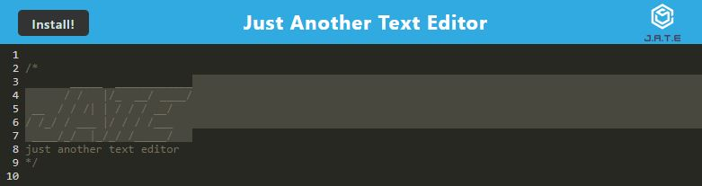

# Text-Editor 5/9/2023

## Description

This project is an application that allows a user to use a handy browser text-editor in order to practice code or save code important code blocks for later use. This application can also be installed to use offline.

## Table of Contents

[Badges](#badges)

[Visuals](#visuals)

[Installation](#installation)

[Usage](#usage)

[Support](#support)

[Contribution](#contribution)

[Authors](#authors)

[License](#license)

<a name="badges"/>

## Badges

N/A

<a name="visuals"/>

## Visuals

A link to the live application is [here.](https://powerful-plains-96032.herokuapp.com/)

<a name="installation"/>

## Installation

This project can be cloned from my GitHub repo link found at the bottom of this project's README file. Once installed node, package.json files, express.js, webpack, webpack-cli, etc. are required to be installed to be able to run this application locally.

Once cloned a command of "npm install" can be run in the terminal to install the necessary dependencies of this project. After this a command of run build can be input into the terminal to build the webpacks needed for this application to run on the browser and be able to be installed to use locally.

<a name="usage"/>

## Usage

This project could be used to store in cache code snippets users find while studying or to practice syntax in their free time.

Once all necessary files are cloned and the package dependencies are installed, the user can run a command of "npm run dev:start" in the terminal to create the webpacks needed to run in the browser.

<a name="support"/>

## Support

N/A

<a name="contribution"/>

## Contributing

The GitHub Repository can be found on the following this link [here.](https://github.com/aguilarj5/Text-Editor)

<a name="authors"/>

## Authors and acknowledgment

GitHub: aguilarj5

Express Documentation link: https://expressjs.com/en/api.html

NPM api link: https://www.npmjs.com/

Webpack Documentation: https://webpack.js.org/concepts/

<a name="license"/>

## License

N/A
